# ACME Corp CSR Platform - Screenshots

## Platform Overview

### Homepage & Hero Section
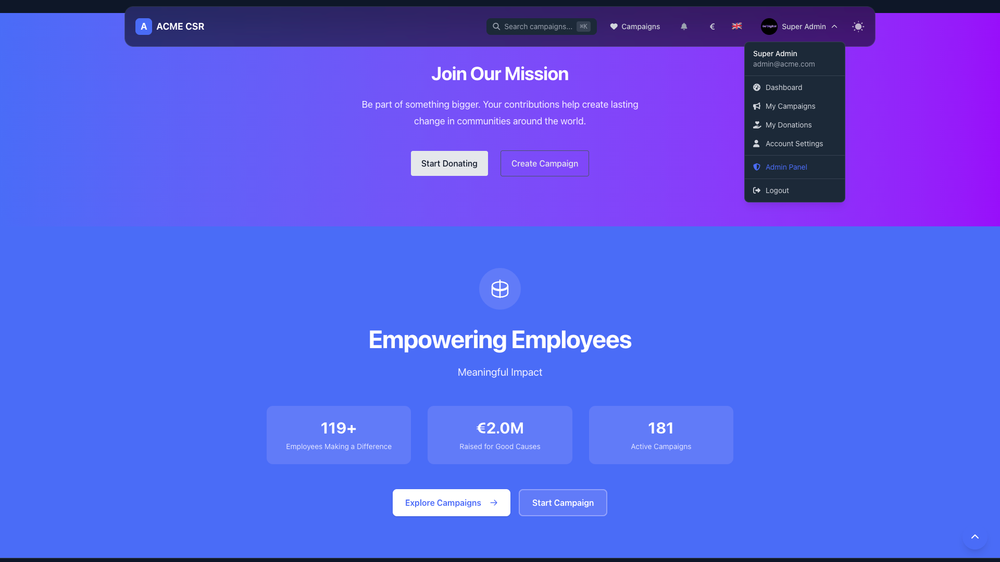
*Engaging landing page with mission statement and call-to-action buttons*

### Dashboard & Analytics
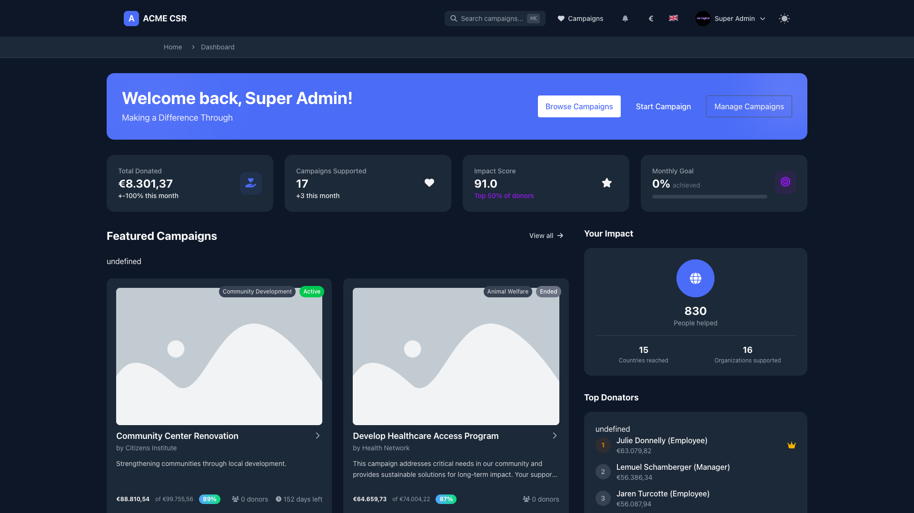
*Comprehensive dashboard showing donation metrics, campaign statistics, and impact scores*

### Campaign Management
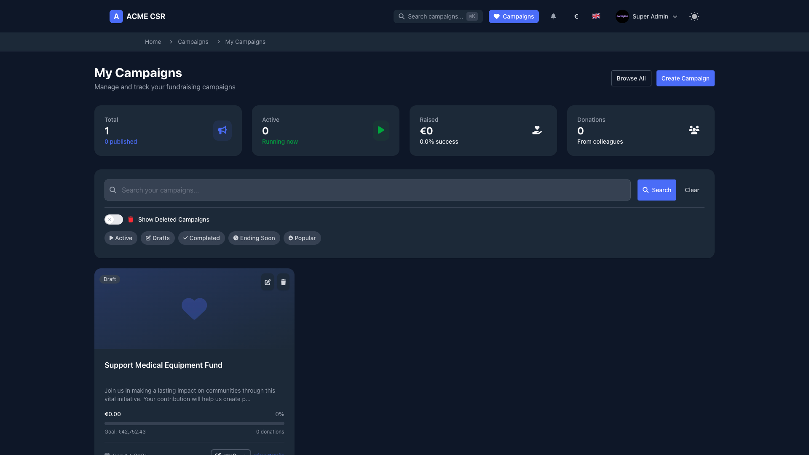
*Campaign management interface with filtering, search, and status tracking*

### Donation Tracking
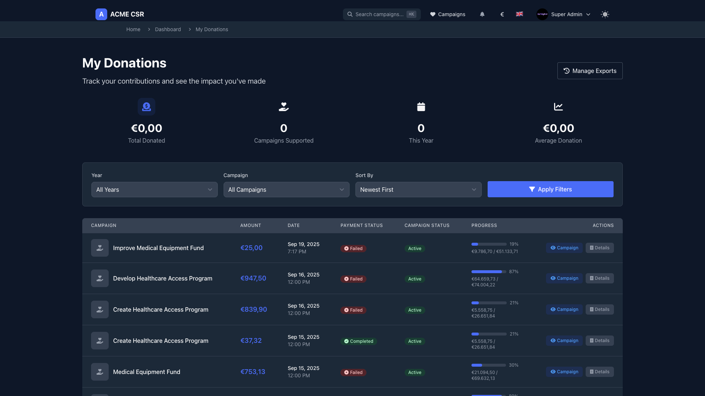
*Detailed donation history with payment status, progress tracking, and campaign details*

### Export Management
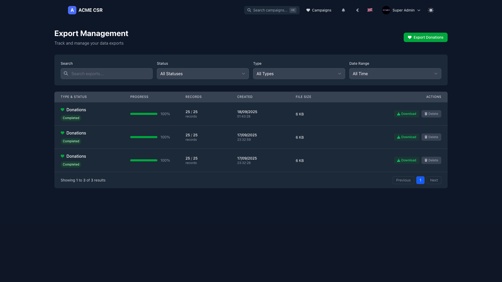
*Data export interface for generating reports and managing downloaded files*

### Payment Processing
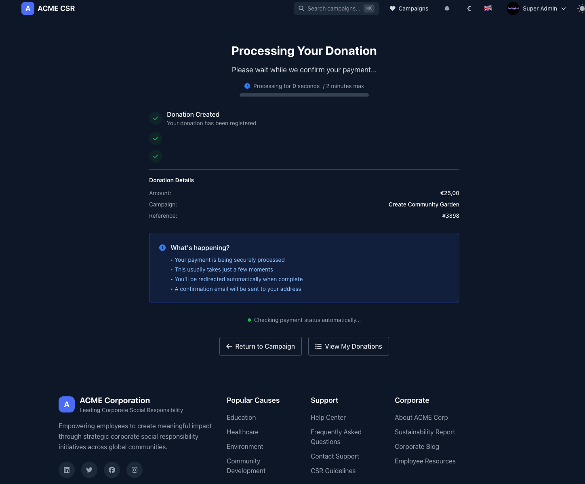
*Real-time payment processing with status updates and confirmation flow*

### Donation Success
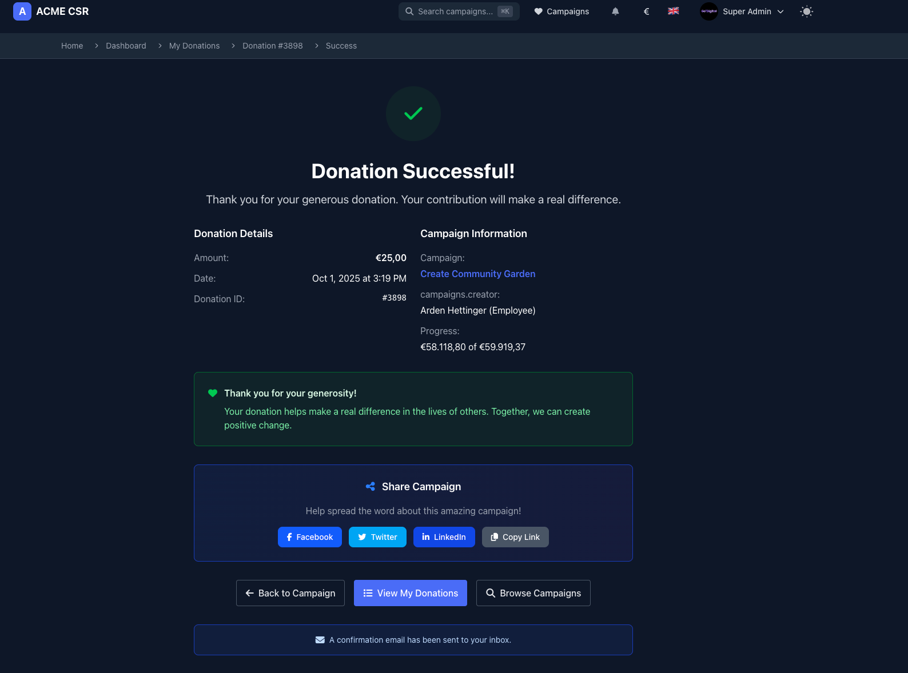
*Confirmation page with donation details, social sharing, and thank you message*

## Admin Panel Features

### Admin Dashboard
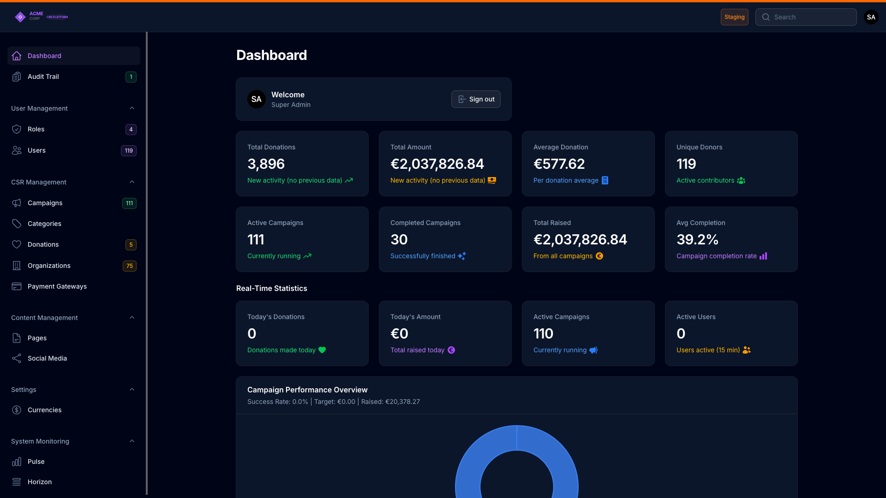
*Comprehensive admin dashboard with real-time statistics, campaign performance, and system monitoring*

### Payment Gateways
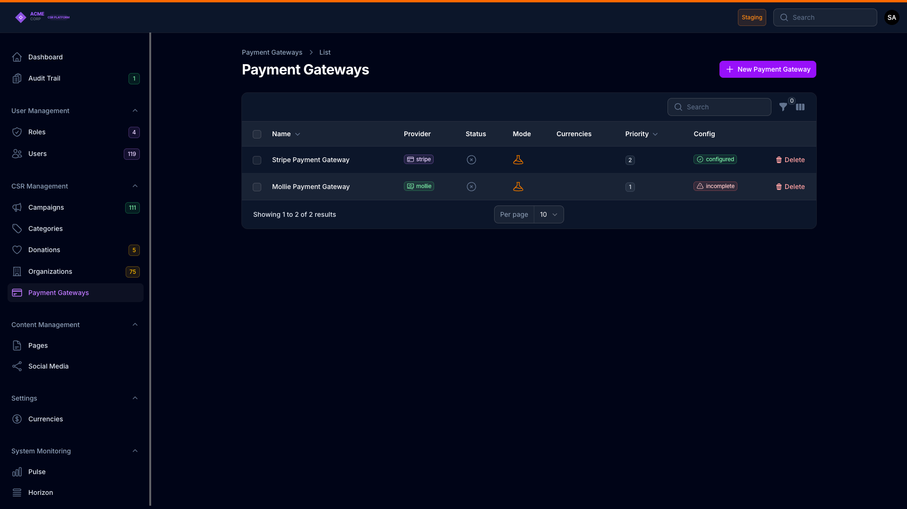
*Multi-gateway payment configuration supporting Stripe, Mollie, and custom providers*

### Categories Management
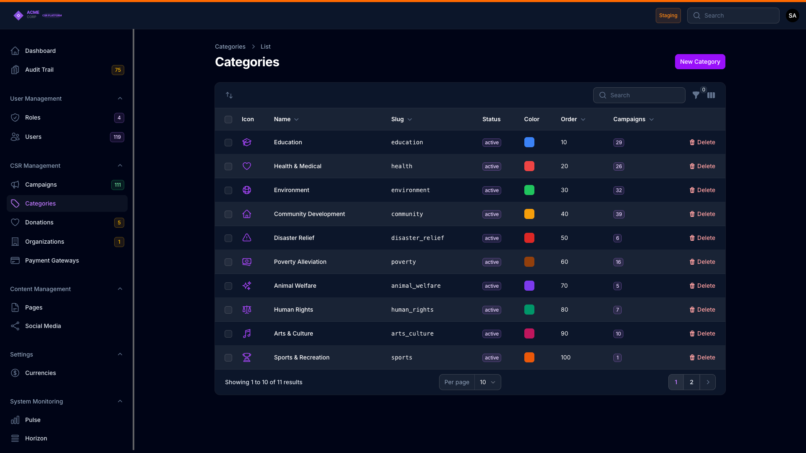
*Campaign category management with icons, colors, slugs, and organization*

### Organization Details
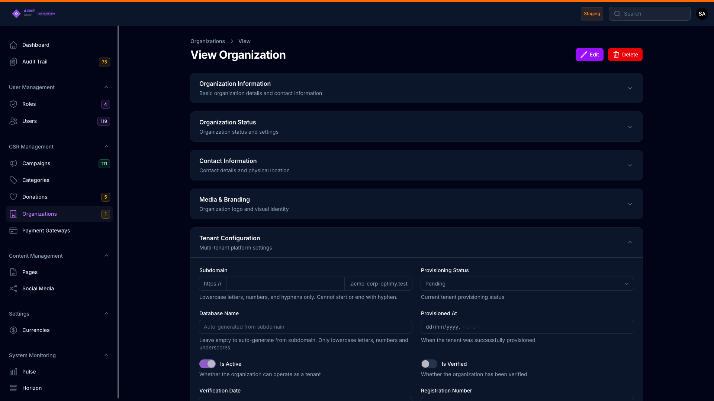
*Multi-tenant organization configuration with subdomain provisioning and branding settings*

---

**Developed and Maintained by [Go2digit.al](https://go2digit.al)**

Specialized in enterprise-grade applications with focus on scalability, security, and maintainability.

Copyright 2025 Go2digit.al - All Rights Reserved
